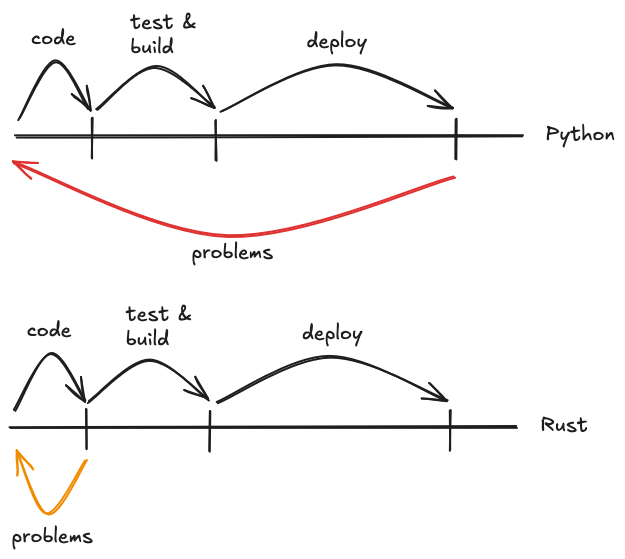

# Cooking parsers with Winnow

---

## Idea


<small>
Photo by <a href="https://unsplash.com/@johnpaulsen?utm_content=creditCopyText&utm_medium=referral&utm_source=unsplash">John Paulsen</a> on <a href="https://unsplash.com/photos/white-vehicle-near-tree-MJeyFglfq9E?utm_content=creditCopyText&utm_medium=referral&utm_source=unsplash">Unsplash</a> and edited by me
</small>

Note: Everything started with an idea in my garage, that would take me into an endless rabbit hole and it would make no money, but I loved it.

---

### What idea?

Exchanging recipes

[reciperium.com](https://reciperium.com) <!-- .element: class="fragment" data-fragment-index="0" -->

----

#### Short history

- 2020: created first prototype in python + ts
- 2021: discovered rust and cook-lang
- 2023: started reciperium in rust + ts

---

### Why Rust as a solo dev?

#### INSANE RELIABILITY <!-- .element: class="fragment" data-fragment-index="0" -->

Note:
- fast iteration (next slide)
- can host for cheap
- scales well
- things just work
- easy to maintain
- easy to reproduce
- easy to refactor

---



---

## What was I needing?

- A way to write recipes that was easy for humans and machines <!-- .element: class="fragment" data-fragment-index="0" -->
- Single file <!-- .element: class="fragment" data-fragment-index="1" -->

---

## What's the problem with recipes?

Many sections

- ingredients
- materials
- instructions
- and more

---

## What's the problem with recipes?

---

## Challenges faced

---

### Why building a parser in rust?

- for fun <!-- .element: class="fragment" data-fragment-index="0" -->
- for performance <!-- .element: class="fragment" data-fragment-index="1" -->

---

## Choosing a parser library

- combinators (code)
- grammars

Notes:
- is there a correct one? No
- combinators are more intuitive to me, easier to test

---

### Combinator example

`winnow`

```rs
fn hex_primary(input: &mut &str) -> PResult<u8> {
    take_while(2, |c: char| c.is_ascii_hexdigit())
        .try_map(|input| u8::from_str_radix(input, 16))
        .parse_next(input)
}
```

<small>
<a href="https://docs.rs/winnow/latest/winnow/#example">docs.rs/winnow/latest/winnow/#example</a>

</small>

----

### Grammar example

`pest`

```
alpha = { 'a'..'z' | 'A'..'Z' }
digit = { '0'..'9' }

ident = { (alpha | digit)+ }

ident_list = _{ !digit ~ ident ~ (" " ~ ident)+ }
```

<small>
<a href="https://pest.rs/">pest.rs/</a>

</small>
---

### Comparisson

| Grammar | Combinator |
| ---------------------------- | ----------------- |
| New syntax | Familiar language |
| Reuse in other languages* |  |
| Rely on macros |

| |
| --- |
| Bindings for other languages  |
| Easier to maintain than regexes^2 |

\* In theory <!-- .element: class="fragment" data-fragment-index="0" -->

Notes:
- This is almost never the case

---

## Grammars & Parsers

---

## What's in the rust market?

- pest
- winnon & nom

---

## Winnow

----

## Setup

```sh
cargo add winnow
```

<i data-lucide="menu"></i>

----

### Main usage

```rs [1-14|2|4-9|8|12]
use winnow::combinator::alt;
use winnow::{PResult, Parser};

pub fn parse_foobar_bool(i: &mut &str) -> PResult<bool> {
    alt((
        "foo".value(true),
        "bar".value(false)
    )).parse_next(i)
}
fn main() {
    let input = "foo";
    let out = parse_foobar_bool.parse(input).unwrap();
    println!("{}", out);
}
```

<small>
<a
    href="https://play.rust-lang.org/?version=stable&mode=debug&edition=2021&gist=6b5293f427f6b6933f013dd99abdd6d8" target="_blank">
    <i data-lucide="play"></i>
</a>
</small>


notes:
- PResult handles winnow errors with `ErrMode`
- Parser implements combinators for common types: `&str`, `&[u8]`, `char`, etc
- 4-9 is a combinator
- `parse_next` used inside comb
- `parse` for our main parser
