<base target="_blank">

# Cooking parsers with Winnow

---


### Santiago

 <!-- .element: class="fragment" data-fragment-index="0" width="200px" style="margin: 0" -->

locations 🇦🇷 🇳🇱  <!-- .element: class="fragment" data-fragment-index="1" -->

experience 🐍 🦀  <!-- .element: class="fragment" data-fragment-index="1" -->
 <!-- .element: class="fragment" data-fragment-index="1" height="35px" width="35px" style="margin: 0"-->

---

### Content

1. Beginnings
2. Parsers
3. Winnow
4. Demo

---

### An Idea 💡

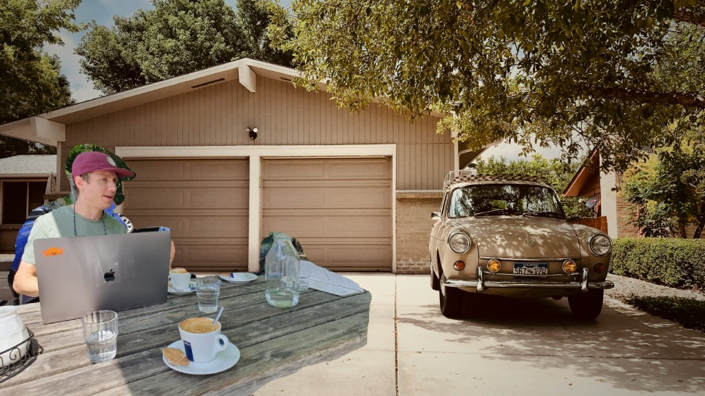
<small>
Photo by <a href="https://unsplash.com/@johnpaulsen?utm_content=creditCopyText&utm_medium=referral&utm_source=unsplash">John Paulsen</a> on <a href="https://unsplash.com/photos/white-vehicle-near-tree-MJeyFglfq9E?utm_content=creditCopyText&utm_medium=referral&utm_source=unsplash">Unsplash</a> and edited by me
</small>

Note:
- Everything began
- idea in a garage
- would take me into an endless rabbit hole
- makes no money
- I love it

---

### What idea?

Exchanging and tune recipes

Notes:
- I'm picky, if you like pineapple doesn't mean you like pineapple pizza

----

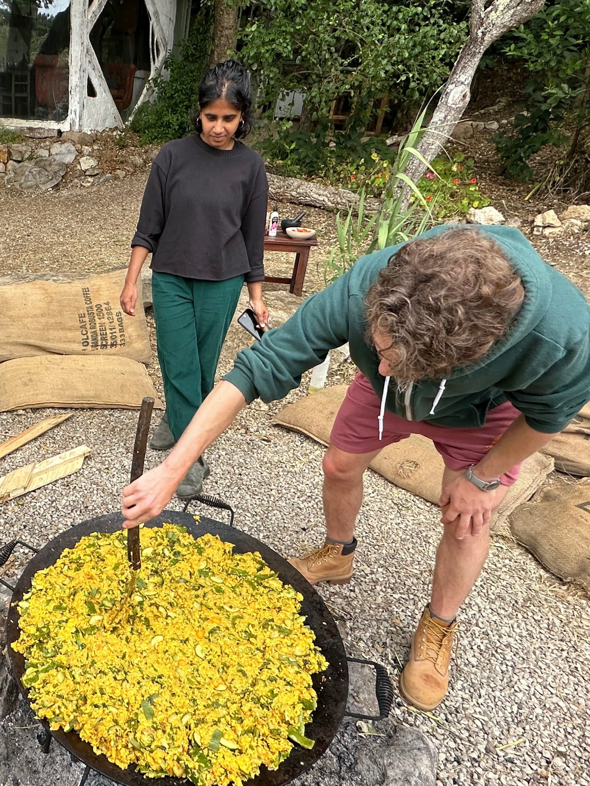 <!-- .element:  width="200px" style="margin: 0" -->
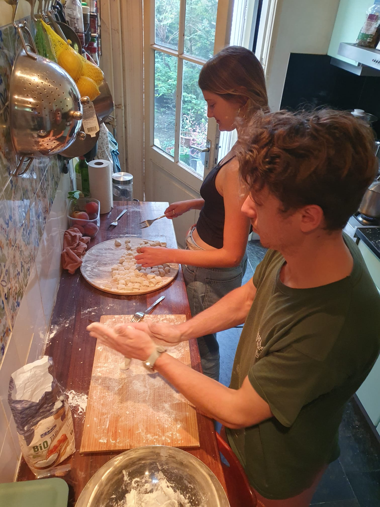 <!-- .element: class="fragment" data-fragment-index="0" width="200px" style="margin: 0" -->
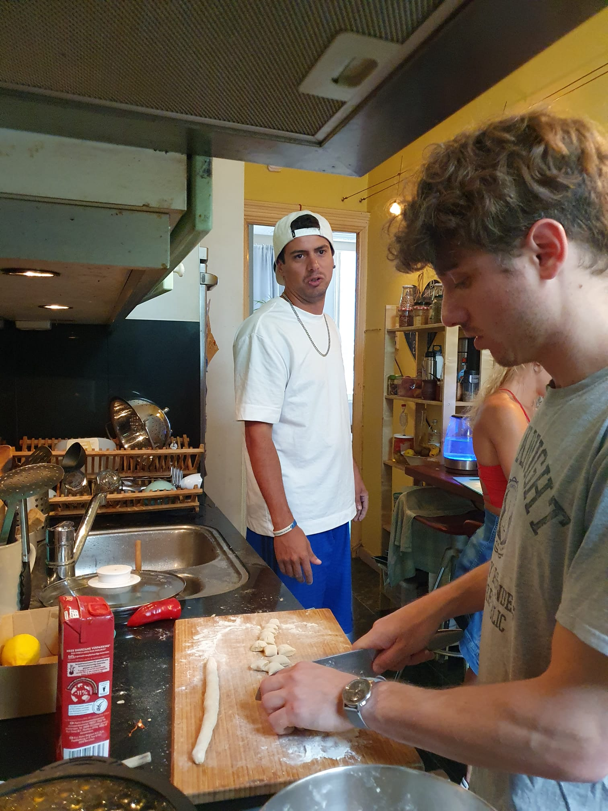 <!-- .element: class="fragment" data-fragment-index="1" width="200px" style="margin: 0" -->
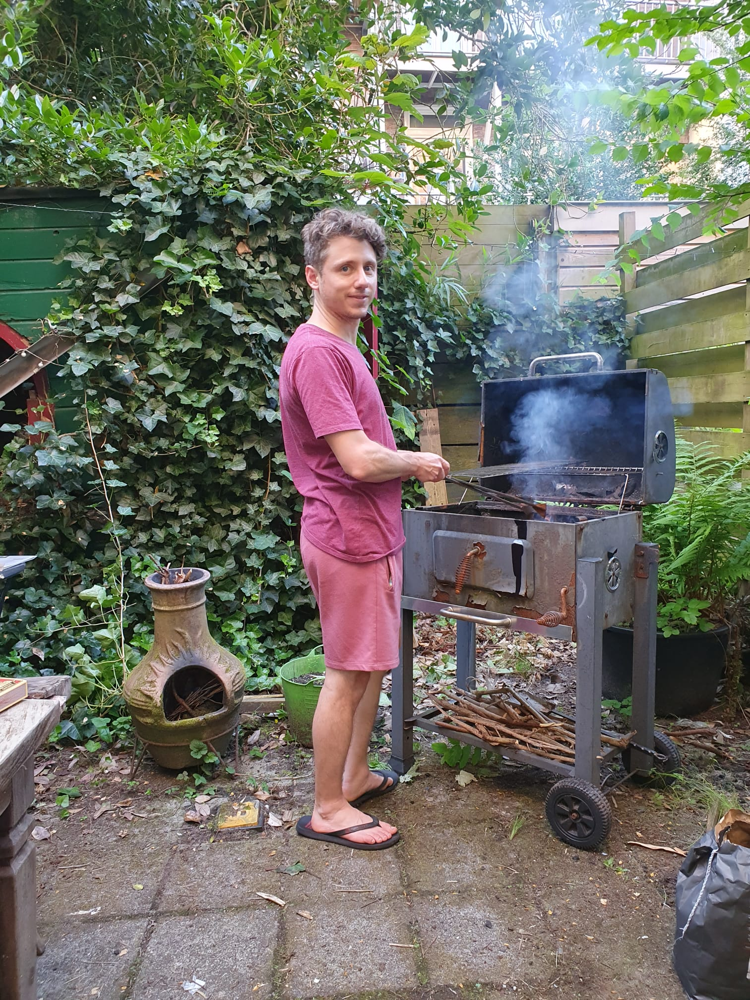 <!-- .element: class="fragment" data-fragment-index="2" width="200px" style="margin: 0" -->
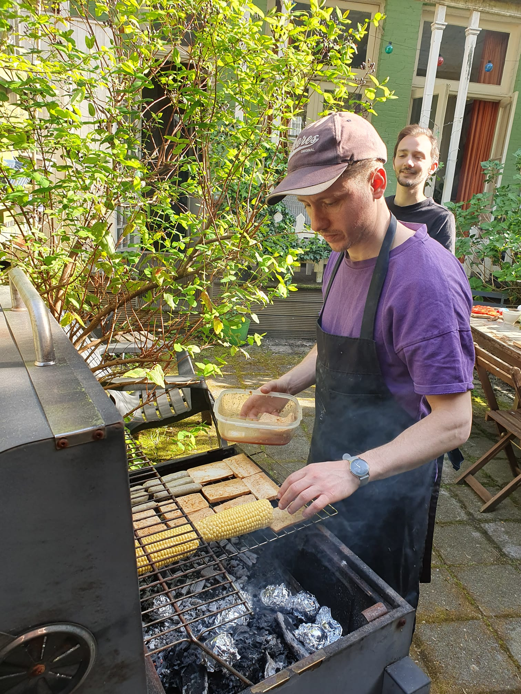 <!-- .element: class="fragment" data-fragment-index="3" width="200px" style="margin: 0" -->
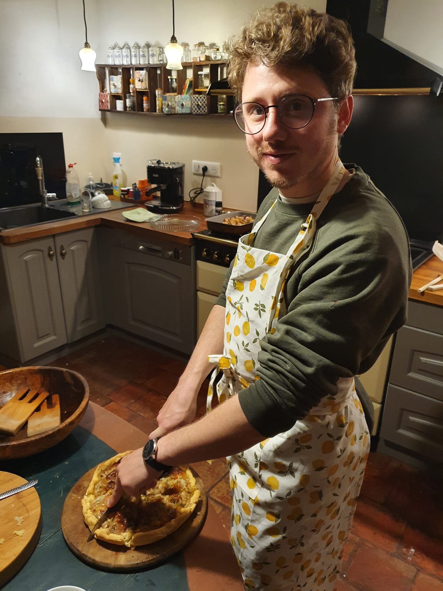 <!-- .element: class="fragment" data-fragment-index="4" width="200px" style="margin: 0" -->
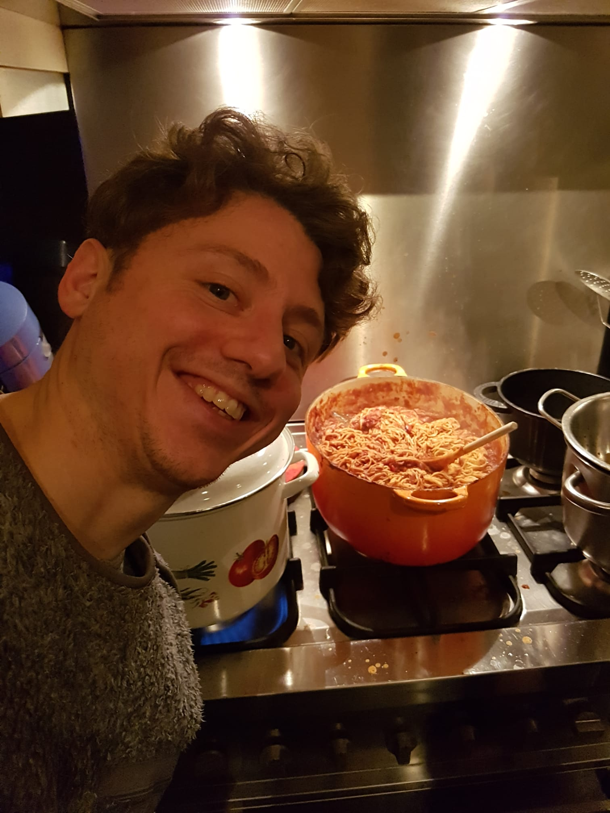 <!-- .element: class="fragment" data-fragment-index="5" width="200px" style="margin: 0" -->
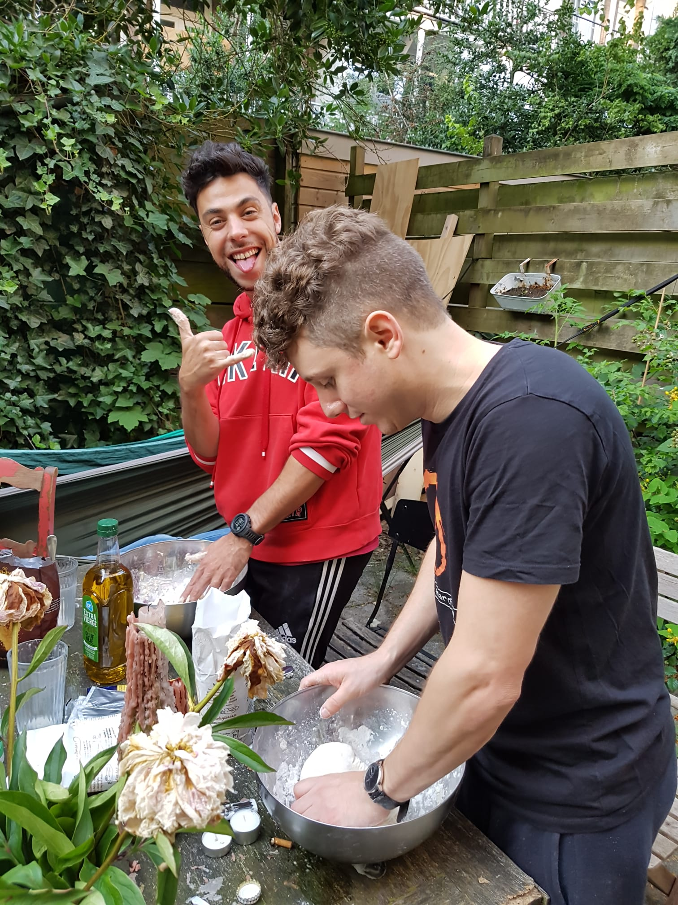 <!-- .element: class="fragment" data-fragment-index="6" width="200px" style="margin: 0" -->

----
<!-- .slide: data-auto-animate -->

#### Short history

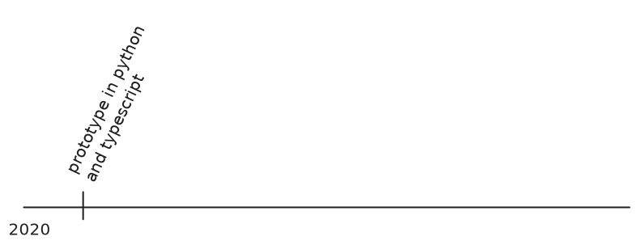

----

<!-- .slide: data-auto-animate -->

#### Short history

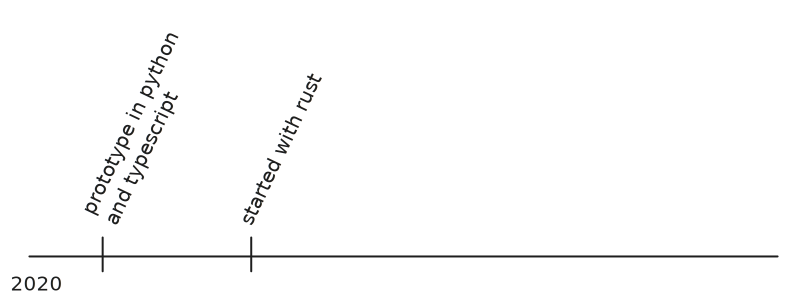

----

<!-- .slide: data-auto-animate -->

#### Short history

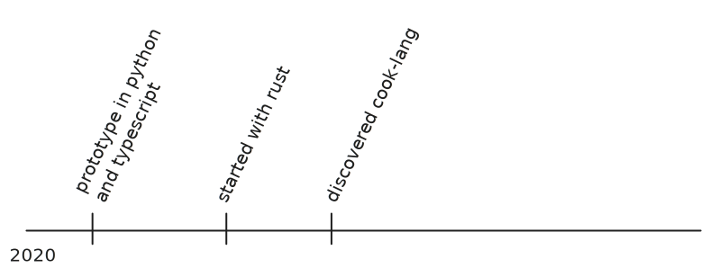

----

<!-- .slide: data-auto-animate -->

#### Short history

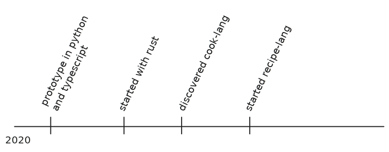

----

<!-- .slide: data-auto-animate -->

#### Short history

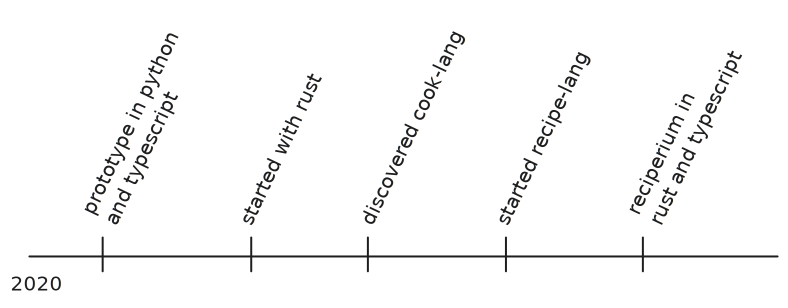

----

## recipe-lang

```recp
Take {potatoes}(3) and wrap them in &{aluminium foil}.
Throw them in the fire of the grill
Wait for t{1 hour}
```

 <!-- .element:  width="40px" style="margin: 0" -->
[reciperium/recipe-lang](https://github.com/reciperium/recipe-lang)

---

### Why Rust as a solo dev?

#### INSANE CONFIDENCE <!-- .element: class="fragment" data-fragment-index="0" -->

Note:
- performance by default
- cheap hosting
- scales well
- things just work
- fast iteration (next slide)

---

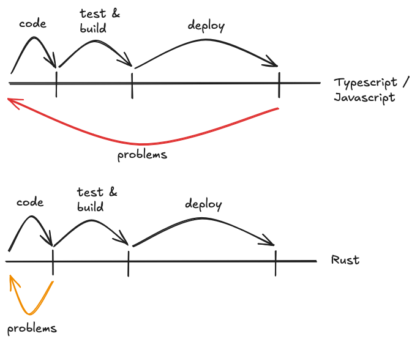

Note:
- easy to maintain
- easy to reproduce
- easy to refactor

---

## What was I needing?

- A way to write recipes that was easy for humans and machines <!-- .element: class="fragment" data-fragment-index="0" -->
- Single file <!-- .element: class="fragment" data-fragment-index="1" -->

---

## What's the problem with recipes?

Many sections

- ingredients
- materials
- instructions
- and more

---

### Why building a parser in rust?

- for fun <!-- .element: class="fragment" data-fragment-index="0" -->
- for performance <!-- .element: class="fragment" data-fragment-index="1" -->
- for portability <!-- .element: class="fragment" data-fragment-index="2" -->

---

## What is a parser?

----

### First: What is a grammar?

> a finite set of rules to generate strings that are in the grammar
<!-- .element: class="fragment" data-fragment-index="0" -->

```sql
SELECT ( ALL | DISTINCT )?
    ( <star> | (
        <select sublist> ( <comma> <select sublist> )* )
    )
```
<!-- .element: class="fragment" data-fragment-index="1" -->

- SELECT is a terminal <!-- .element: class="fragment" data-fragment-index="1" -->
- \<select sublist\> is a non-terminal <!-- .element: class="fragment" data-fragment-index="1" -->

Notes:
- it's actually a context-free grammar
- it's context free because it doesn't have to consider the context
- popular: Backus Normal Form (BNF)
- terminal: like a literal value
- non-terminal: reference to another rule (play this rule)

----

### Then: What is a parser?

> A tool that maps a series of tokens to grammar rules to create a syntax tree, identifying errors if the token sequence is invalid
<!-- .element: class="fragment" data-fragment-index="0" -->

----

<!-- .slide: class="grid grid-cols-2 items-center content-center" -->

```json
{
  "name": "jon doe",
  "age": 18,
  "address": {
    "street": "Evrgrn Terace",
    "number": 742
  }
}
```

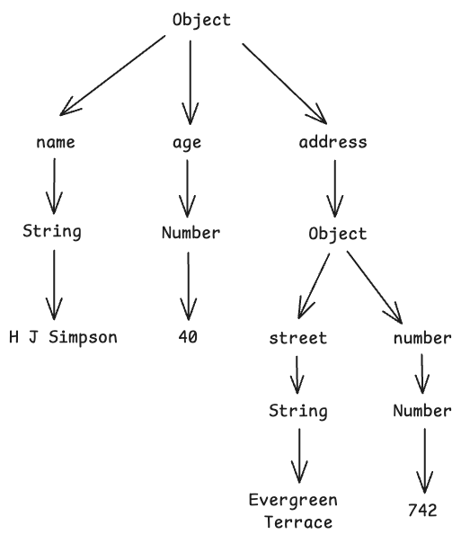 <!-- .element: class="fragment" data-fragment-index="0" width="300px" -->

----
<!-- .slide: data-auto-animate -->
### Disclaimer

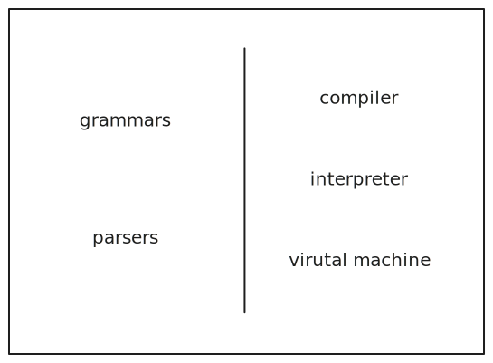

----
<!-- .slide: data-auto-animate -->
### Disclaimer

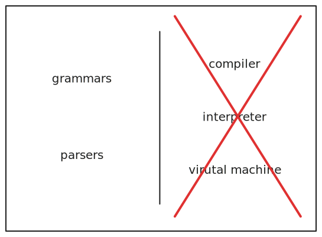

---

## Choosing a parser

- combinators (code)
- grammars
- regex

Notes:
- is there a correct one? No
- combinators: a mix of parser functions combined into a parser
- combinators are more intuitive to me, easier to test
- grammars: context-free grammar

---

### Combinator example

`winnow`

```rs
fn hex_primary(input: &mut &str) -> PResult<u8> {
    take_while(2, |c: char| c.is_ascii_hexdigit())
        .try_map(|input| u8::from_str_radix(input, 16))
        .parse_next(input)
}
```

<small>
<a href="https://docs.rs/winnow/latest/winnow/#example">docs.rs/winnow/latest/winnow/#example</a>

</small>

----

### Grammar example

`pest`

```
alpha = { 'a'..'z' | 'A'..'Z' }
digit = { '0'..'9' }

ident = { (alpha | digit)+ }

ident_list = _{ !digit ~ ident ~ (" " ~ ident)+ }
```

<small>
<a href="https://pest.rs/">pest.rs/</a>

</small>

----

### Regex

```re text-wrap
(?:[a-z0-9!#$%&'*+/=?^_`{|}~-]+(?:\.[a-z0-9!#$%&'*+/=?^_`{|}~-]+)*|"(?:[\x01-\x08\x0b\x0c\x0e-\x1f\x21\x23-\x5b\x5d-\x7f]|\\[\x01-\x09\x0b\x0c\x0e-\x7f])*")@(?:(?:[a-z0-9](?:[a-z0-9-]*[a-z0-9])?\.)+[a-z0-9](?:[a-z0-9-]*[a-z0-9])?|\[(?:(?:(2(5[0-5]|[0-4][0-9])|1[0-9][0-9]|[1-9]?[0-9]))\.){3}(?:(2(5[0-5]|[0-4][0-9])|1[0-9][0-9]|[1-9]?[0-9])|[a-z0-9-]*[a-z0-9]:(?:[\x01-\x08\x0b\x0c\x0e-\x1f\x21-\x5a\x53-\x7f]|\\[\x01-\x09\x0b\x0c\x0e-\x7f])+)\])
```

---

### Comparisson

| Grammar | Combinator | Regex |
| --- | --- | --- |
| New syntax | Familiar language | New syntax |
| Reuse in other languages* |  | Reuse in other languages* |
| Rely on macros | | |
| Maintanable | Maintanable | Depends |

| |
| --- |
| Bindings for other languages  |


\* In theory <!-- .element: class="fragment" data-fragment-index="0" -->


Notes:
- This is almost never the case
- antlr works in many languages (not rust)

---

## What's in the rust market?

- grammars: [pest](https://github.com/pest-parser/pest), [peg](https://github.com/kevinmehall/rust-peg)
- combinators: [winnow](https://github.com/winnow-rs/winnow), [nom](https://github.com/rust-bakery/nom), [chumsky](https://github.com/zesterer/chumsky)
- regex: [regex](https://github.com/rust-lang/regex)

[and more](https://github.com/rosetta-rs/parse-rosetta-rs "target='_blank'")

---

## Winnow

- Excellent documentation with tutorials
- Very extendable
- Performant
- A fork of `nom` by [epage](https://github.com/epage)

----

## Setup

```sh
cargo add winnow
```

----

### Main usage

```rs [1-14|2|4,8|8,12]
use winnow::combinator::alt;
use winnow::{PResult, Parser};

pub fn parse_foobar_bool(i: &mut &str) -> PResult<bool> {
    alt((
        "foo".value(true),
        "bar".value(false)
    )).parse_next(i)
}
fn main() {
    let input = "foo";
    let out = parse_foobar_bool.parse(input).unwrap();
    println!("{}", out);
}
```

<small>
<a
    href="https://play.rust-lang.org/?version=stable&mode=debug&edition=2021&gist=6b5293f427f6b6933f013dd99abdd6d8" target="_blank">
    <i data-lucide="play"></i>
</a>
</small>


notes:
- PResult handles winnow errors with `ErrMode`
- Parser implements combinators for common types: `&str`, `&[u8]`, `char`, etc
- 4-9 is a combinator
- `parse_next` used inside comb
- `parse` for our main parser

---

## Demo

---

### JSONOO

(JSON Object Only)

_/Jay • SO • NOOOO/_ <!-- .element: class="fragment" data-fragment-index="0" -->


---

## Thanks


 <!-- .element:  width="40px" style="margin: 0" --> [@woile](https://hachyderm.io/@woile)
&nbsp;&nbsp;&nbsp;
 <!-- .element:  width="50px" style="margin: 0" --> [woile](https://github.com/woile)

santiwilly@gmail.com
